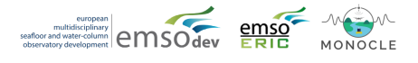

[](10.5281/zenodo.2643207)

Mooda is a python package designed mainly for oceanographers and marine science students. It is based on a power scripting system for:

* open and analyze data files from scientific instrumentation and platforms
* generate data quality control
* make plots that are commonly used in the oceanographic community
* make data files in netCDF and CSV format

# Why to use mooda and how it works

In an oceanographic data file, metadata (the definition of data) is almost as relevant as the data. Without them, you do not know what the data means.

There are libraries, such as pandas, that allow you to manipulate the data quickly, but they do not give you the possibility to save the metadata.

With mooda, we work with WaterFrames. A WaterFrame object contains a pandas DataFrame and two dictionaries. With a WaterFrame, you can open data files; data is stored into the DataFrame, and the metadata is stored into the dictionaries. With a WaterFrame, you can use the power of a pandas DataFrame without loose all the metadata information. Additionally, mooda helps to open and analyze raw data from scientific instruments and data from oceanographic platforms.

# Where to get it

Binary installers for the latest released stable version are available at the [Python package index](https://pypi.org/project/mooda/)

```cmd
pip install mooda
```

See more [instructions](docs/installation/installation.md) for installation from sources or non-PyPi releases.

# Documentation

The official documentation is hosted here, on the [docs directory](docs/index_docs.md).

# Projects that use or have used mooda



# License

[MIT](LICENSE)
