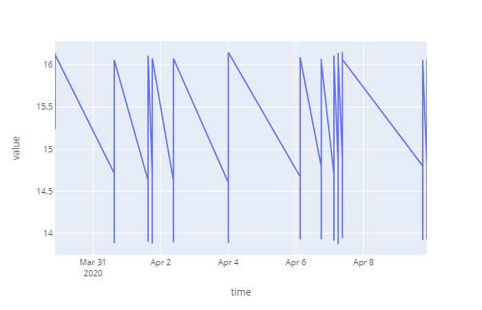

# mooda.emso.get_fig_line(*depth_max*=*None*, *depth_min*=*None*, *depth_qcs*=*[]*, *end_time*=*''*, *metadata_ids*=*[]*, *parameters*=*[]*, *platform_codes*=*[]*, *size*=*10*, *start_time*=*''*, *sort*=*'desc'*, *time_qcs*=*[]*, *title*=*''*, *value_qcs*=*[]*, *x*=*'time'*, *y*=*'value'*)

## Reference

Get the plotly figure 'line' from the EMSO ERIC API.

### Parameters

* depth_max: Maximun depth of the measurement (int)
* depth_min: Minimum depth of the measurement (int)
* depth_qcs: List of QC values accepted for the depth_qc field (List[int])
* end_time: Maximum date of the measurement (str)
* metadata_ids: List of accepted 'metadata_id' (List[str])
* parameters: List of accepted 'parameter' (List[str])
* platform_codes: List of accepted 'platform_code' (List[str])
* size:  Number of values to make the graph (int)
* start_time: Minimun date of the meassurement (str)
* sort: Options: 'asc' or 'desc'. Get the first or last (in time) measurements (str)
* time_qcs: List of accepted values for the field time_qc (List[int])
* title: Title of the figure (str)
* value_qcs: List of accepted values for the field of value_qc (List[int])
* x: Field for the x-axis (str)
* y: Field for the y-axis (str)

### Returns

* fig: Plotly figure (dict)

### Example

```python
import mooda as md
import plotly.io as pio

emso = md.util.EMSO(user='LOGIN', password='PASSWORD')

fig = emso.get_fig_line(parameters=['TEMP'], platform_codes=['68422'], size=100)
pio.show(fig)
```

Output:



Return to [Index](../../index_api_reference.md).
