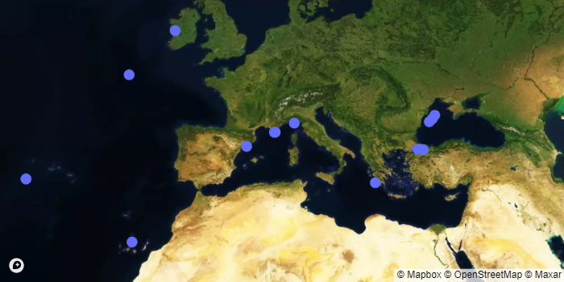

# mooda.emso.get_fig_map(*parameters*=*[]*, *platform_codes*=*[]*, *sites*=*[]*)

## Reference

Get the plotly figure 'line' from the EMSO ERIC API.

### Parameters

* parameters: List of accepted 'parameter' (List[str])
* platform_codes: List of accepted 'platform_code' (List[str])
* sites: List of accepted 'site' (List[str])

### Returns

* fig: Plotly figure (dict)

### Example

```python
import mooda as md
import plotly.io as pio

emso = md.util.EMSO(user='LOGIN', password='PASSWORD')

fig = emso.get_fig_map()
pio.show(fig)
```

Output:



Return to [Index](../../index_api_reference.md).
