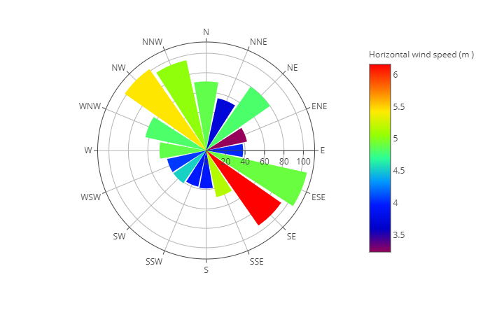

# wf.iplot_bar_polar(theta, color, r='auto', template='xgridoff', color_continuous_scale='auto', **kwds)

It uses plotly.express.bar_polar.

In a polar bar plot, each row of 'color' is represented as a wedge mark in polar coordinates.

## Reference

### Parameters

* theta: wf.data colum with the directions in degrees (str)
* color: wf.data colum with the data to plot with colors (str)
* r: wf.data column with the data to use as a radius (str)
  * If r = 'auto', r is the counts of 'theta' en each direction.
* template: Plotly express style templates (str)
  * Options: 
    * 'ggplot2'
    * 'seaborn'
    * 'simple_white'
    * 'plotly'
    * 'plotly_white'
    * 'plotly_dark'
    * 'presentation'
    * 'xgridoff'
    * 'ygridoff'
    * 'gridon'
    * 'none'
* color_continuous_scale: View https://plotly.com/python/colorscales/ (plotly.express.sequential)
  * If color_continuous_scale = 'auto', color_continuous_scale = px.colors.sequential.Rainbow
* **kwds: plotly.express.bar_polar arguments

### Returns

* fig: (plotly.graph_objects.Figure)


## Example

For this example we are going to download wind direction and wind speed data from EMSO platform 68422. We will download 1000 values without specifying the time range or depth.

```python
import mooda as md

wf = md.from_emso(platform_code='68422', parameters=['WDIR', 'WSPD'], size=1000)

# Resample data hourly
wf.resample('H')

fig = wf.iplot_bar_polar('WDIR', 'WSPD')
fig.show()
```

Output:

*Note - The output graph is interactive. Below is the figure saved in a png image.*



Return to [mooda.WaterFrame](../waterframe.md).
