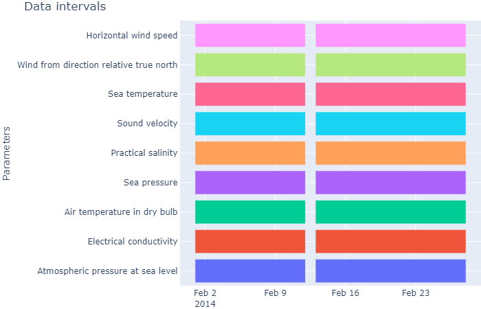

# wf.iplot_data_intervals(*resample_rule*=*'D'*, ***kwds*)

## Reference

It uses plotly.express.timeline. It creates a plot to view the time intervals of the parameters.

### Parameters

* resample_rule: Resample rule. (None, str)
* **kwds: Arguments from plotly.express.timeline

### Returns

* figure: Dictionary of Plotly figure. (dict)

## Example

To reproduce the example, download the NetCDF file [MO_TS_MO_OBSEA_201401.nc](http://data.emso.eu/files/emso/obsea/mo/ts/2014/MO_TS_MO_OBSEA_201401.nc).

```python
import mooda as md

wf = md.read_nc_emodnet("MO_TS_MO_OBSEA_201402.nc")

fig = wf.iplot_data_intervals()
fig.show()

```

Output:

The output of this script is an interactive graph that cannot be displayed on the GitHub environment. To get the interactive chart, download and run this script on your computer. Below you will find the chart exported to png.



Return to [mooda.WaterFrame](../waterframe.md).
