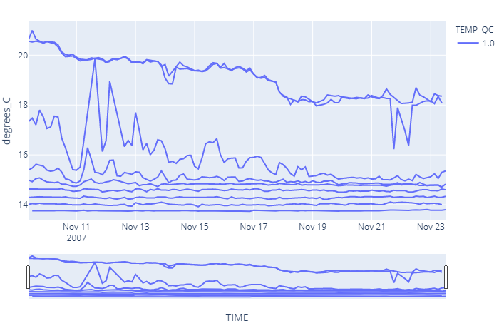

# wf.iplot_line(y, x='TIME', marginal_x=None, marginal_y='histogram', color='auto', range_y='auto', line_shape='lineard', rangeslider_visible=True, line_group='DEPTH', **kwds)

It uses plotly.express.line.

Each data point is represented as a marker point, whose location is given by the x and y columns of self.data.

## Reference

### Parameters

* y: Y axis, column or index of data. (str)
* x: X axis, column or index of data. (str)
* color: Name of a column or index of data. Values from this column are used to assign color to marks. (str)
  * If color = 'auto', color = QC column of *y*.
* symbol: Name of a column or index of data. Values from this column are used to assign symbols to marks. (str)
* range_y: \[min value, max value\] of y axes. (list)
  * If range_y = 'auto', range is generated between the min and max values of y axes +- 5%.
* line_shape: Line options: 'linear' 'spline', 'vhv', 'hvh', 'vh', 'hv' (str)
* rangeslider_visible: Show a time range slide on the bottom x axes. (bool)
* line_group: Either a name of a column in wf.data, or a pandas Series or array_like object. Values from this column or array_like are used to group rows of data_frame into lines. (str or int or Series or array-like)
* **kwds: Plotly express scatter keywords. (keywords)

### Returns

* fig: (plotly.graph_objects.Figure)


## Example

For this example we are going to download water temperature data from EMSO platform 68422. We will download 1000 values without specifying the time range or depth.

```python
import mooda as md

wf = md.from_emso(platform_code='68422', parameters=['TEMP'], size=1000)

fig = wf.iplot_line('TEMP')
fig.show()
```

Output:

*Note - The output graph is interactive. Below is the figure saved in a png image.*



Return to [mooda.WaterFrame](../waterframe.md).
