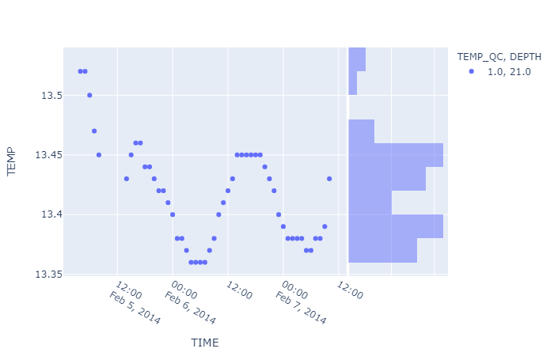

# wf.iplot_scatter(*y*, *x*=*'TIME'*, *trendline*=*None*, *marginal_x*=*None*, *marginal_y*=*'histogram'*, *color*=*'auto'*, *symbol*=*'DEPTH'*, *range_y*=*'auto'*, ***kwds*)

It makes an interactive scatter plot.

## Reference

### Parameters

* y: Y axis, column or index of data. (str)
* x: X axis, column or index of data. (str)
* trendline: (str)
  * Options:
    * None
    * 'ols': Ordinary Least Squares regression line will be drawn for each discrete-color/symbol group.
    * 'ols_np': Ordinary Least Squares regression line will be drawn for each discrete-color/symbol group. Line generated with numpy.polyfit with all values of y axes.
    * 'lowess': Locally Weighted Scatterplot Smoothing line will be drawn for each discrete-color/symbol group.
* marginal_x: If set, a horizontal subplot is drawn above the main plot, visualizing the x-distribution. (str)
  * Options:
    * None
    * 'rug'
    * 'box'
    * 'violin'
    * 'histogram'
* marginal_y: If set, a horizontal subplot is drawn above the main plot, visualizing the y-distribution. (str)
  * Options:
    * None
    * 'rug'
    * 'box'
    * 'violin'
    * 'histogram'
* color: Name of a column or index of data. Values from this column are used to assign color to marks. (str)
  * If color = 'auto', color = QC column of *y*.
* symbol: Name of a column or index of data. Values from this column are used to assign symbols to marks. (str)
* range_y: \[min value, max value\] of y axes. (list)
  * If range_y = 'auto', range is generated between the min and max values of y axes +- 5%.
* **kwds: Plotly express scatter keywords. (keywords)

### Returns

* fig: (plotly.graph_objects.Figure)


## Example

To reproduce the example, download the NetCDF file [MO_TS_MO_OBSEA_201402.nc](http://data.emso.eu/files/emso/obsea/mo/ts/2014/MO_TS_MO_OBSEA_201402.nc).

```python
import mooda as md

path_netcdf = "MO_TS_MO_OBSEA_201402.nc"  # Path of the NetCDF file
wf = md.read_nc_emodnet(path_netcdf)

fig = wf.iplot_scatter('TEMP', marginal_y='histogram')
fig.show()
```

Output:

The output of this script is an interactive graph that cannot be displayed on the GitHub environment. To get the interactive chart, download and run this script on your computer. Below you will find the chart exported to png.



Return to [mooda.WaterFrame](../waterframe.md).
