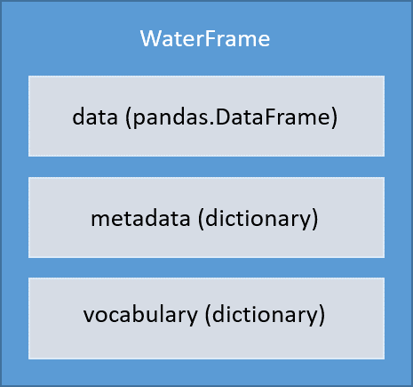

# mooda.WaterFrame()

The WaterFrame object has been designed to contain all the information that can be obtained from a NetCDF file. WaterFrame relies on a `pandas.DataFrame` to save and manipulate data and two dictionaries to collect metadata.



The following describes the components of a WaterFrame:

* data: pandas.DataFrame where are the data to analyze or graph.
* metadata: Dictionary with all the related information to the data. Here the general attributes of a NetCDF file are saved.
* vocabulary: Here, the attributes of each variable are saved.

## Magic methods

### Constructor

It creates an empty `pandas.DataFrame` called WaterFrame.data and two dictionaries called WaterFrame.vocabulary and WaterFrame.metadata.

### \_\_repr__()

It returns a printable representational string of the WaterFrame with the following information:

* Consumption of memory of the WaterFrame
* Name of parameters
* Description of the parameters
* Units of the parameters
* Minimum value of each parameter
* Maximum value of each parameter
* Mean value of each parameter

## Properties

### WaterFrame.parameters

We call parameter to the key of the WaterFrame.data column containing "_QC". For example, a WaterFrame.data that contains the keys: POSITION, TEMP, TEMP_QC, PSAL, PSAL_QC; the parameters are TEMP and PSAL.

#### Example

To reproduce the example, download the NetCDF file [here](http://data.emso.eu/files/emso/obsea/mo/ts/MO_TS_MO_OBSEA.nc) and save it as `example.nc` in the same python script folder.

```python
import mooda as md

path_netcdf = "example.nc"  # Path of the NetCDF file

wf = md.read_nc_emodnet(path_netcdf)
print(", ".join(wf.parameters))

```

Output:

```shell
DEPH, ATMS, CNDC, DRYT, PRES, PSAL, SVEL, TEMP, WDIR, WSPD
```

### WaterFrame.memory_usage

It returns the memory usage of the WaterFrame in bytes.

To reproduce the example, download the NetCDF file [here](http://data.emso.eu/files/emso/obsea/mo/ts/MO_TS_MO_OBSEA.nc) and save it as `example.nc` in the same python script folder.

```python
import mooda as md

path_netcdf = "example.nc"  # Path of the NetCDF file

wf = md.read_nc_emodnet(path_netcdf)
print(f"{wf.memory_usage} bytes")

```

Output:

```shell
142484054 bytes
```

## Methods

### Data analysis

* [WaterFrame.copy()](./analysis/copy.md): Get a copy of the WaterFrame.
* [WaterFrame.corr()](./analysis/corr.md): Compute pairwise correlation of data columns of parameter1 and parameter2, excluding NA/null values.
* [WaterFrame.drop(*parameters*, *inplace*=*True*)](./analysis/drop.md): Remove input parameters from WaterFrame.data.
* [WaterFrame.info_metadata(*keys*=*None*)](./analysis/info_metadata.md): It returns a formatted string with the metadata information.
* [WaterFrame.info_vocabulary(*keys*=*None*)](./analysis/info_vocabulary.md): It returns a formatted string with the vocabulary information.
* [WaterFrame.max_diff(parameter1, parameter2)](./analysis/max_diff.md): It calculates the maximum difference between the values of two parameters.
* [WaterFrame.max(*parameter*)](./analysis/max.md): Get the maximum value of a parameter.
* [WaterFrame.min(*parameter*)](./analysis/min.md):  Get the minimum value of a parameter.
* [WaterFrame.rename(*actual_name*, *new_name*, *inplace*=*True*)](./analysis/rename.md): It renames a parameter.
* [WaterFrame.resample(*rule*, *method*=*'mean'*, *inplace*=*True*)](./analysis/resample.md): Convenience method for frequency conversion and sampling of time series of the WaterFrame object.
* [WaterFrame.time_intervals(*parameter*, *frequency*)](./analysis/time_intervals.md): It returns the index (TIME) of intervals between NaNs.
* [WaterFrame.use_only(*parameters_to_use*, *inplace*=*True*)](./analysis/use_only.md): It deletes all parameters except the input parameters.
* [WaterFrame.reduce_memory(*inplace*=*True*)](./analysis/reduce_memory.md): It reduces the WaterFrame size in memory by 30% - 50%

### Output

* [WaterFrame.metadata_to_html()](./output/metadata_to_html.md): Make a html file with the metadata information.
* [WaterFrame.to_csv()](./output/to_csv.md): Create a CSV file with the WaterFrame data.
* [WaterFrame.to_es()](./output/to_es.md): Injestion of the WaterFrame into a ElasticSeach DB.
* [WaterFrame.to_json()](./output/to_json.md): Get a JSON with the WaterFrame information.
* [WaterFrame.to_nc(*path*, *nc_format*=*"NETCDF4"*)](./output/to_nc.md): Save the WaterFrame into a NetCDF.
* [WaterFrame.to_pkl(*path*)](./output/to_pkl.md): Save the WaterFrame in a Pickle file.

### Static plot

* [WaterFrame.plot_hist(*parameters*=*None*, *mean_line*=*False*, ***kwds*)](./plot/plot_hist.md): Make a histogram of the WaterFrame's. A histogram is a representation of the distribution of data.
* [WaterFrame.plot_timebar(*keys*, *ax*=*None*, *time_interval_mean*=*None*)](./plot/plot_timebar.md): Make a bar plot of the input keys. The bars are positioned at x with date/time. Their dimensions are given by height.
* [WaterFrame.plot_timeseries(*parameters_to_plot*=*None*, *qc_flags*=*None*, *rolling_window*=*None*, ax=*None*, *average_time*=*None*, *secondary_y*=*None*, *color*=*None*)](./plot/plot_timeseries.md): Plot the input parameters with time on X and the parameters on Y. It calculates the standar deviation of a rolling window and plot it.
* [WaterFrame.plot(***kwds*)](./plot/plot.md): It calls the pandas DataFrame.plot() method.

### Interactive plot

* [WaterFrame.iplot_location()](./iplot/iplot_location.md): It creates a Plotly Figure with a map and a spot of the measurement location of the WaterFrame.
* [WaterFrame.iplot_timeseries(*parameters_to_plot*=*None*)](./iplot/iplot_timeseries.md): It creates a Plotly figure with the time-series of the input parameters.
* [WaterFrame.iplot_scatter(*y*, *x*=*'TIME'*, *trendline*=*None*, *marginal_x*=*None*, *marginal_y*=*'histogram'*, *color*=*'auto'*, *symbol*=*'DEPTH'*, *range_y*=*'auto'*, ***kwds*)](.iplot/iplot_scatter.md): It makes an interactive scatter plot.
* [WaterFrame.iplot_data_intervals(*resample_rule*=*'D'*, ***kwds*)](.iplot/iplot_data_intervals.md): It creates a plot to view the time intervals of the parameters.

### Data Quality Control

* [WaterFrame.qc_flat_test(*parameters*=*None*, *window*=*3*, *flag*=*4*, *inplace*=*True*)](./qc/qc_flat_test.md): It detects if there are equal consecutive values in the time series.
* [WaterFrame.qc_range_test(*parameters*=*None*, *limits*=*None*, *flag*=*4*, *inplace*=*True*)](./qc/qc_range_test.md): Check if the values of a parameter are out of range.
* [WaterFrame.qc_spike_test(*parameters*=*None*, *window*=*0*, *threshold*=*3*, *flag*=*4*, *inplace*=*True*)](./qc/qc_spike_test.md): It checks if there is any spike in the time series.

Return to [API reference](../index_api_reference.md).
