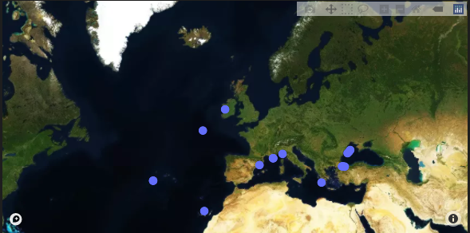

# How to download EMSO data and perform QC data tests with a Jupyter Notebook Widget

Este widget es la combinación de los widgets [mooda.widget_emso()](emso-widget.md) y [mooda.widget_qc()](qc-widget.md).

```python
import mooda as md

wf = md.WaterFrame()

gui = md.widget_emso_qc(wf)
gui
```

Output:




Return to the [Index of examples](index_examples.md).
