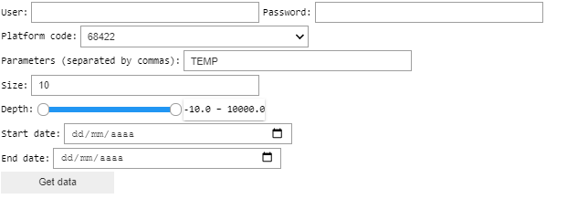
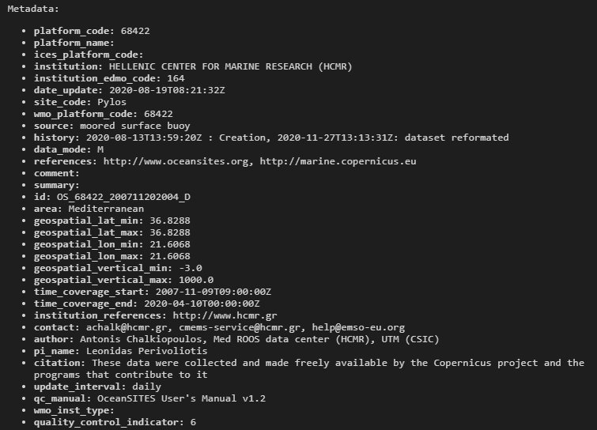
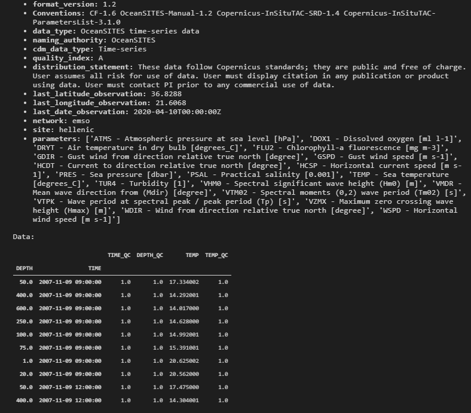

# How to download EMSO data with a Jupyter Notebook Widget

The mooda library contains a function for downloading data through the [EMSO API](http://api.emso.eu/). The function is called [mooda.from_emso(*...*)](../api_reference/input/from_emso.md) and returns a WaterFrame object. This function can also be called via a Jupyter Notebook Widget.

The widfet creates a form. In this example you want to discharge 10 water temperature values from Observatory 68422. The date period is not specified.

```python
import mooda as md

wf = md.WaterFrame()

gui = md.widget_emso(wf)
gui
```

Output:



After clicking on 'Get Data':

```
Done
Memory usage: 3.242 KBytes
Parameters:
  - TEMP: Parameter without meaning
    - Min value: 14.017000198364258
      - DEPTH: 600.0
      - TIME: 2007-11-09 09:00:00
    - Max value: 20.625001907348633
      - DEPTH: 1.0
      - TIME: 2007-11-09 09:00:00
    - Mean value: 16.362000751495362
```

Now we have the data in the wf variable.

```python
wf
```

Output:




Return to the [Index of examples](index_examples.md).
