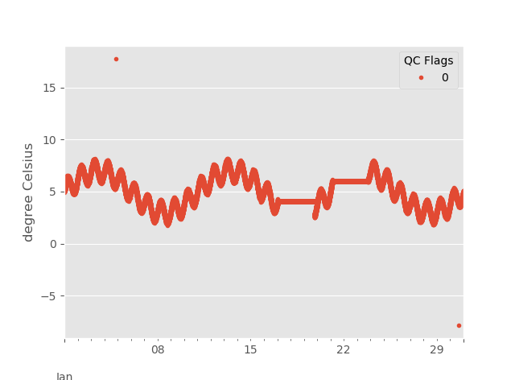
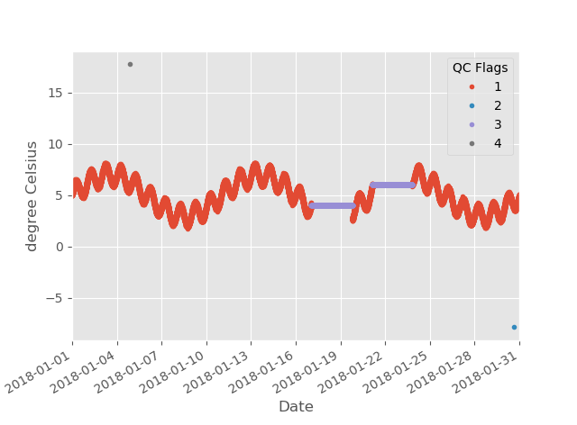
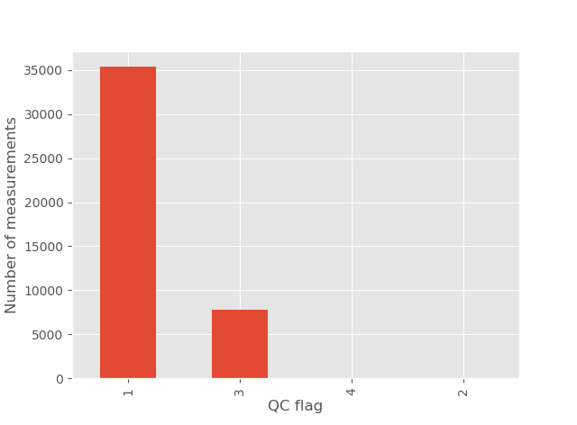

# Quality Control Flag generation in temperature time series from a pickle file

In this example, we are going to analyze a time series of water temperature to know what data seems to be good or bad. We will generate the QC flags of our time series (fictitious, created with another script) that is inside a pickle file. We are going to use the WaterFrame object of the oceanobs package and the following functions:

* [WaterFrame.from_pickle()](../api.md#WaterFrame.from_pickle(*path*))
* [WaterFrame.parameters()](../api.md#WaterFrame.parameters())
* [WaterFrame.reset_flag()](../api.md#WaterFrame.reset_flag(*key*,_*flag*=*0*))
* [WaterFrame.spike_test()](../api.md#WaterFrame.spike_test(*key*,_*window*=*0*,_*threshold*=*3*,_*flag*=*4*))
* [WaterFrame.range_test()](../api.md#WaterFrame.range_test(*key*,_*flag*=*4*))
* [WaterFrame.flat_test()](../api.md#WaterFrame.flat_test(*key*,_*window*=*3*,_*flag*=*4*))
* [WaterFrame.flag2flag()](../api.md#WaterFrame.flag2flag(*key*,_*original_flag*=*0*,_*translated_flag*=*1*))
* [WaterFrame.qcbarplot()](../api.md#WaterFrame.qcbarplot(*key*=*"all"*,_*ax*=*None*))

The pickle file is placed into the [example_data](../example_data/) folder, with the name "bad_temp.pkl."

Customarily, we import as follows:

```python
import oceanobs as oc
import matplotlib.pyplot as plt
```

This is optional, but I like to use the plot style 'ggplot'.

```python
import matplotlib.style as style
style.use('ggplot')
```

Now we create the WaterFrame object and load data from file path location. In our case, we have the file in the same folder of the python script.

```python
wf = oc.WaterFrame()
wf.from_pickle(r"bad_temp.pkl"")
```

The file contains the parameter "seawater temperature" with the name "TEMP."

```python
print("Parameters:", wf.parameters())
```

Output:

```bash
Parameters: ['TEMP']
```

First, we are going to reset all QC Flags of the time series. We are going to write their values to 0 (indicating that no QC test has been passed). Then, we are going to view the time series in a graph related to the QC flags. Figure 1 shows the time series. As you can see, two points do not follow the time series, and that surely would be measurement errors. There are also two sections of the series where all values are equal, probably due to another measurement error.

```python
wf.reset_flag(key='TEMP')
wf.qcplot('TEMP')
plt.show()
```

Output:

<center>
    <figure>
        
        <figcaption> Figure 1: Time series of temperature related to QC Flags </figcaption>
    </figure>
</center>

The output of the WaterFrame.qcplot function is a matplotlib.AxesSubplot so you could stylize the figure with the functions and properties of matplotlib.

Now, we will apply the QC tests. In this example, the spikes will be marked with the QC Flag = 4, the out of range values will be flagged as 2 and the pieces with all equal data, with the flag number 3. Figure 2 shows the result.

```python
wf.spike_test(key='TEMP', flag=4)
wf.range_test(key='TEMP', flag=2)
wf.flat_test(key='TEMP', flag=3)
wf.flag2flag(key="TEMP")

wf.qcplot('TEMP')
plt.show()
```

Output:

<center>
    <figure>
        
        <figcaption> Figure 2: Time series of temperature related to QC Flags with tests</figcaption>
    </figure>
</center>

This is all, another way to see the QC flags is with a bar chart, like the one shown in Figure 3.

```python
wf.qcbarplot('TEMP')
plt.show()
```

<center>
    <figure>
        
        <figcaption> Figure 3: Bar graph of QC flag counts</figcaption>
    </figure>
</center>

Since there are very few values with QC 4 and 2, with the default zoom configuration of Figure 3, counts are not seen.

The complete code:

```python
from oceanobs import WaterFrame
import matplotlib.pyplot as plt
import matplotlib.style as style

style.use('ggplot')

path = r"./docs/example_data/bad_temp.pkl"

wf = WaterFrame()
wf.from_pickle(path)

print(wf.parameters())

wf.reset_flag(key='TEMP')
wf.qcplot('TEMP')
plt.show()

wf.spike_test(key='TEMP', flag=4)
wf.range_test(key='TEMP', flag=2)
wf.flat_test(key='TEMP', flag=3)
wf.flag2flag(key="TEMP")

wf.qcplot('TEMP')
plt.show()

wf.qcbarplot('TEMP')
plt.show()
```