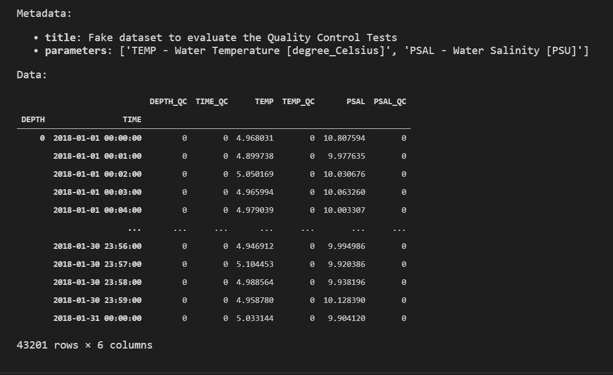
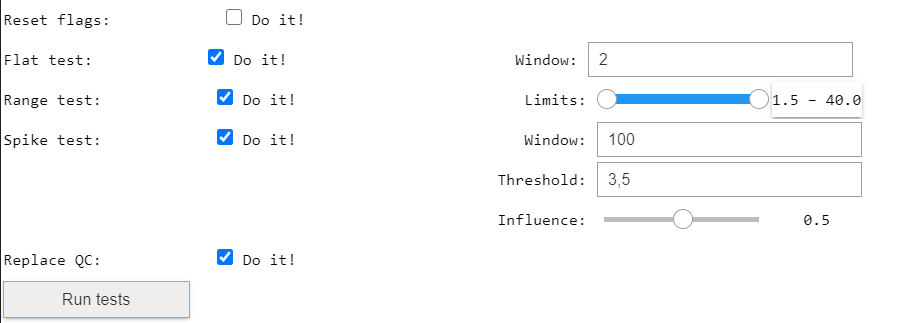
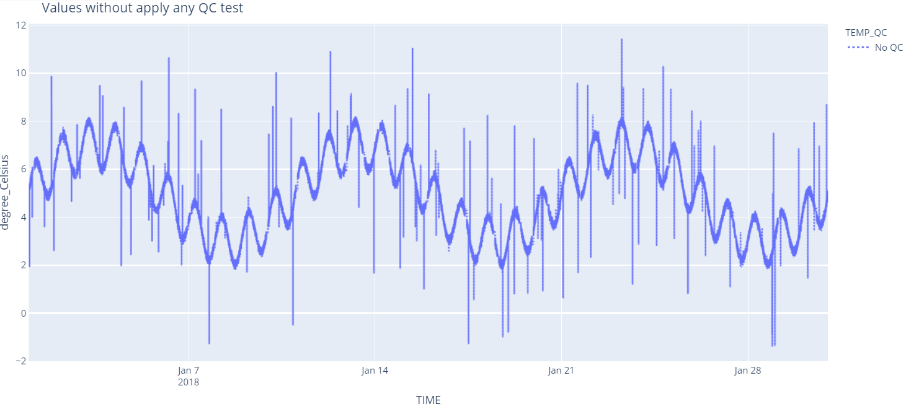
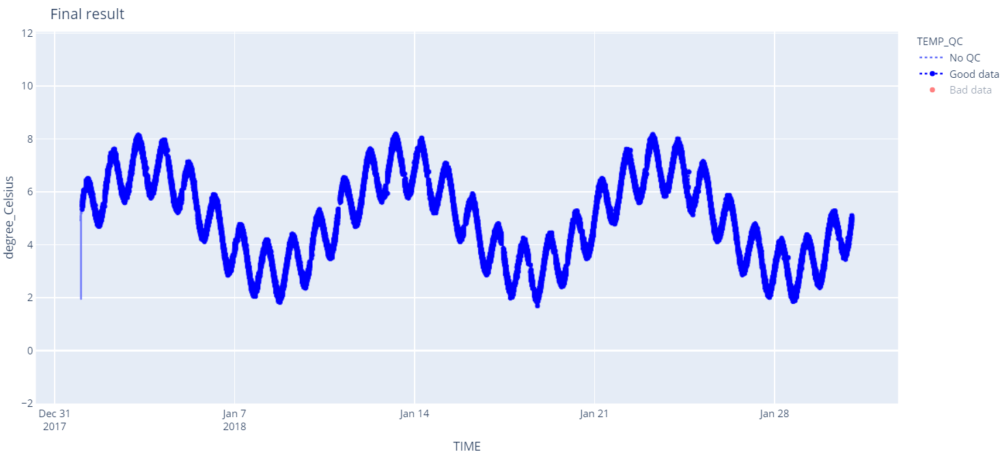

# How to check data quality with a Widget for Jupyter Notebook

In this example, we will first read the dataset [test_qc.pkl](https://github.com/rbardaji/mooda/blob/master/docs/examples/data/test_qc.pkl) that contains water temperature data and then use a Jupyter Notebook widget to check the quality of the data and flag the incorrect data.

To run this example on your computer, you need to download the dataset.

```python
import mooda as md

# Location of the dataset
path = r'docs\examples\data\test_qc.pkl'
# Read the dataset
wf = md.read_pkl(path)

wf
```



Open the widget, loading the WaterFrame with the parameter TEMP (Water Temperature)

Then, check all test (click on 'Do it!') with the following configuration:

* Flat test -> Window: 2
* Range test -> Limits: 1.5, 40
* Spike test -> Window: 100
* Spike test -> Threshold: 3.5
* Spike test -> Influence: 0.5 

Finally, click on 'Run Tests'. The execution of the tests take a while. At the end of each test, the widget shows a graph with the result.

The graphics are interactive. To view the bad data, click the option in the graph legend.

```python
gui = md.widget_qc(wf, 'TEMP', range_test=[0, 50])
gui
```








Return to the [Index of examples](index_examples.md).
