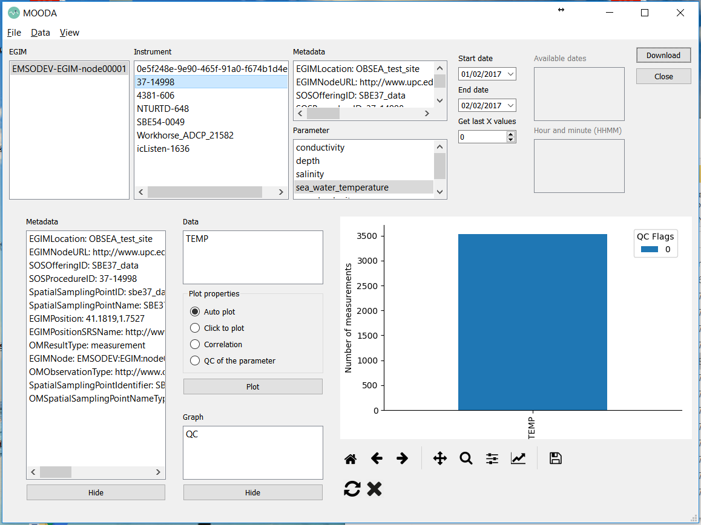
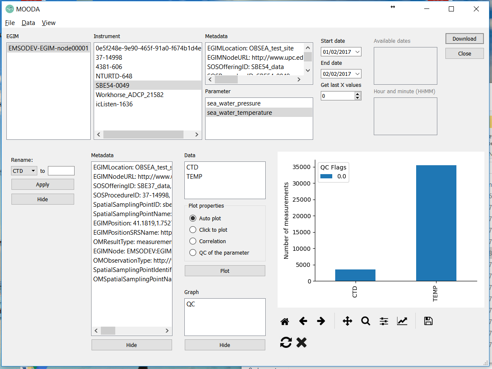
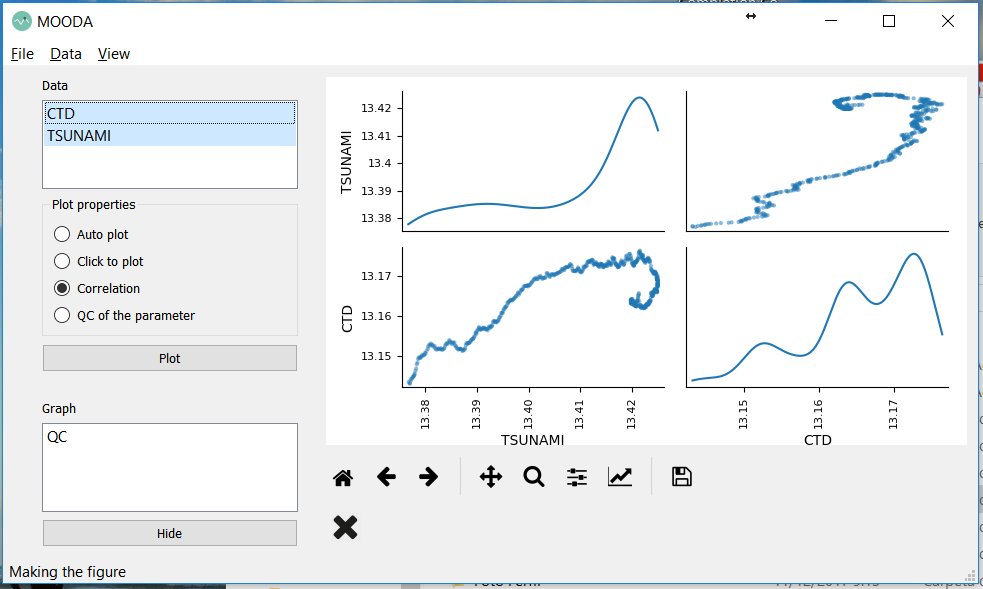
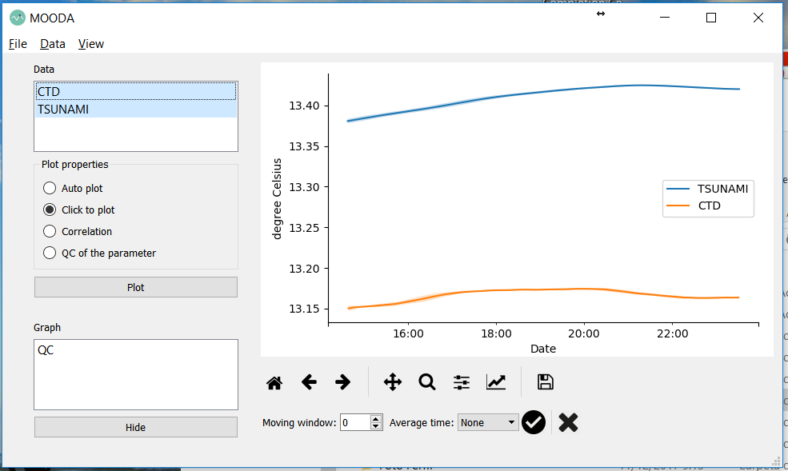
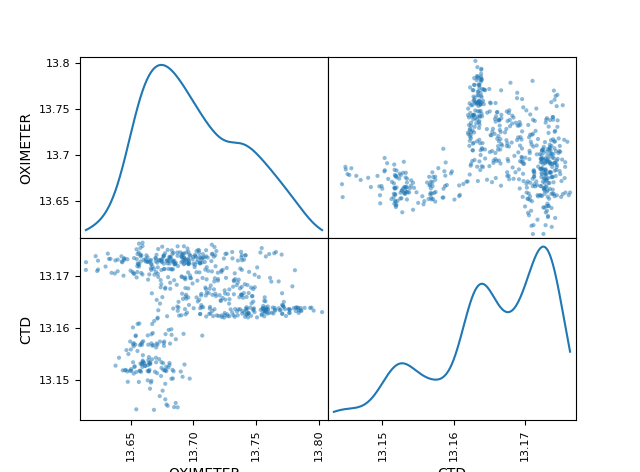
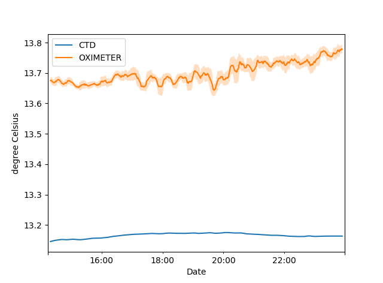

# Compare sea water temperature measurements of two sensors in the same EGIM with MOODA

An [EMSO](http://emso.eu/) Generic Module ([EGIM](http://www.emsodev.eu/)) contains several instruments to characterize some physical properties of water. In this example, we will check if two of the devices that measure water temperature register the same values. We will download temperature data from a CTD and an Oximeter installed in the EGIM Prototipe 1, and later, we will correlate them to obtain conclusions.

Customarily, we open MOODA from a terminal just writing "mooda":

```bash
> mooda
```


Figure 1: Opening EGIM downloader


Figure 2: Downloading a seawater time series from the CTD
of the EGIM



Figure 3: Result of downloading data from the CTD


Figure 4: Renaming TEMP from CTD to "CTD"



Figure 5: Result of downloading a seawater time series from the Tsunameter of the EGIM


Figure 6: Renaming TEMP from Tsunameter to "Tsunameter"


Figure 7: Resample time series



Figure 8: Matrix correlation of the time series



Figure 9: Comparison of measurement of both instruments

Next, we will ask for information about what instruments are in the selected observatory.

We are going to keep the names of the CTD (SBE37-SIP-P7000-RS232) and the oximeter (AADI-3005214831 DW4831).

Then we will ask for information about the parameters that the CTD can measure.

Since we want to compare water temperatures, we will keep the name "sea_water_temperature." The oximeter also measures the water temperature. If you want to check it, you just need to replace "egim.parameters (observatory, instrument_ctd)" with "egim.parameters (observatory, instrument_oximeter)" from the previous code.

Now we are going to ask for information about the metadata of the CTD, and we will keep the answer in the "metadata" variable.

Now we will request for the data or observations. For this example, we will download data generated between 01/02/2017 and 02/02/2017. The data will be saved in the "observation" variable.

Now we will create a WaterFrame object from the downloaded data and metadata.

Now we are also going to request data and metadata from the oximeter. As before, we will then create a WaterFrame object.

Now we are going to rename the parameter "TEMP" of each WaterFrame to the name of the instrument from which it comes so that it is easier to identify them.

We will contact the two Water Frame in one.

The CTD and the Oximeter have different sampling frequencies, so we have different amounts of values in the time series of each instrument. To fix this small inconvenience, we will resample the time series to one measure every minute. We will save the average of the values obtained every minute.

Finally, we compare the measurements drawing a matrix of scatter plots with a histogram plot in the diagonal. Figure 1 shows the result. The two time series of temperature do not seem very correlated ... What can happen?


*Figure 1: Scatter matrix graph*

We have downloaded data from a developing platform. In this case, some sensor is still decalibrated. Figure 2 shows that there is a considerable difference between the measurements of the two instruments. Besides, the Oximeter measures are much noisier than those of the CTD.


*Figure 2: Time series of seawater temperature of the CTD and the Oximeter*

This is optional, but we can save the WaterFrame object as a pickle file.