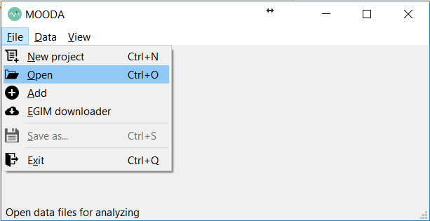
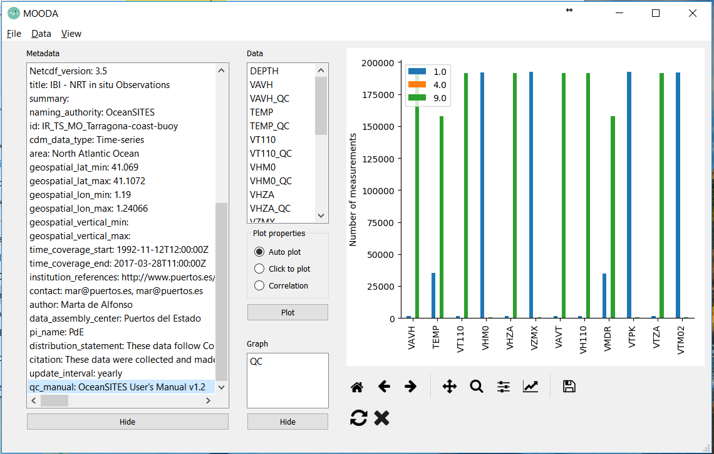
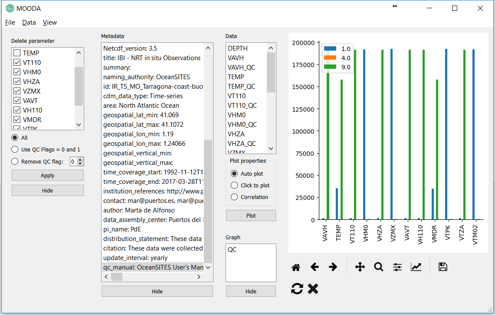
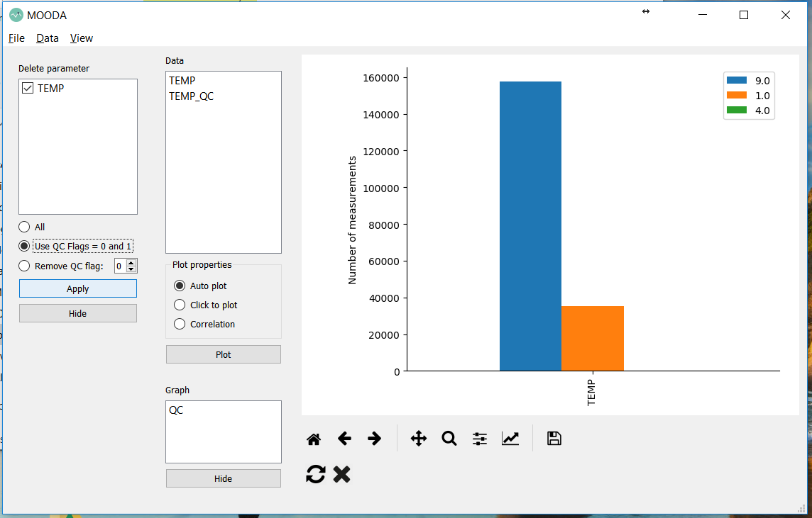
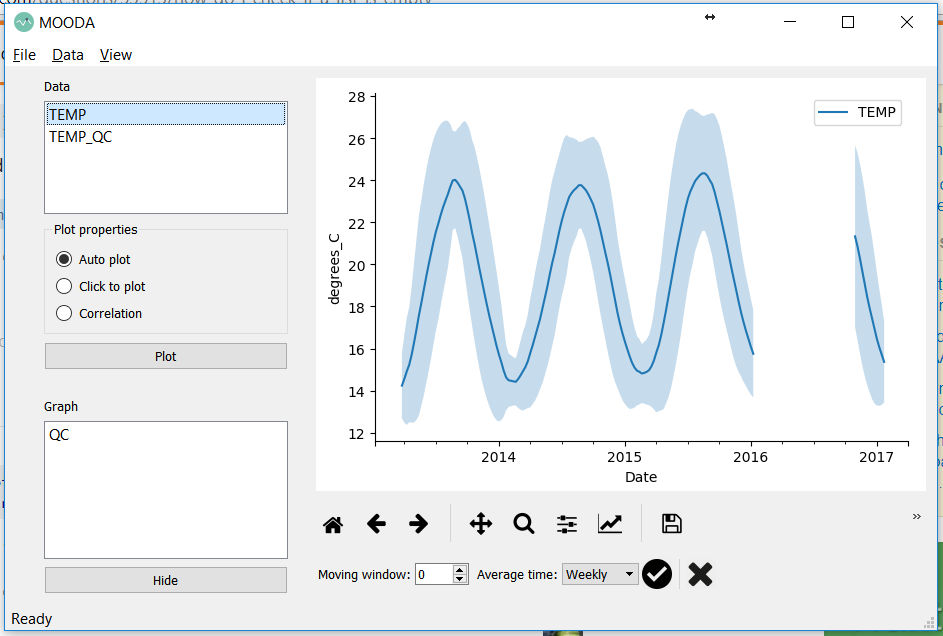

# Analyze a water temperature time series from netCDF files with MOODA

In this example, we will play with a sea water temperature time series of a mooring system near Tarragona (Spain.) We are going to use the MOODA app.

Data comes from a netCDF file of [EMODnet](http://www.emodnet.eu/). EMODnet is a network of organizations that make marine data with European format standards (such as SeaDataNet netCDF standards) freely available. For this example, we have to download the "reprocessed data" from 1992 to 2018 of the [Tarragona-coast-buoy](http://www.emodnet-physics.eu/map/platinfo/piroosdownload.aspx?platformid=28150). You need to register (it is free!) to download the file but you don't want to sign in EMODnet, you can download a monthly period.

Customarily, we open MOODA from a terminal just writing "mooda":

```bash
> mooda
```

Now we load the NetCDF file. Click on File->Open and look for the file downloaded from EMODnet (see Figure 1).



Figure 1: File -> Open

The file contains the parameter "seawater temperature" with the name "TEMP," but also it contains other parameters. Passing the cursor by the name of the parameters, a little more information will appear on the screen. MOODA automatically creates a bar graph with the amount of data with each QC flag.



Figure 2: Main page

Since we only want to use the water temperature, we will eliminate the other parameters to reduce the amount of RAM that MOODA needs to work with the file information. Click on *Data*->*Remove parameter* and select all the parameters that are not necessary. Next, click on *all* to delete all data of the selected parameters, and finally, *Apply* (view Figure 3.)



Figure 3: Remove parameters

In this case, the data has already been preprocessed and already passed some QC tests. For this reason, QC flags of data are different than 0 (0 usually means that data has not already passed any QC test). Data with QC Flag = 1 means that seems to be good. However there are a lot of data with QC Flag = 9, that means that are not number values (maybe the values are "-" or white space). We do not know the reason for this large amount of data values with QC Flag = 9 but maybe is because of an error in the creation of the NetCDF file.

We are only going to work with good data so we will remove all NaN (Not a Number) values. Click on the *TEMP* parameter, and the on *Use QC Flags = 0 and 1*. Finally, click on *Apply* (view Figure 4.)



Figure 4: Remove data with QC Flag different to 0 and 1

Now, click on *TEMP* of the *Data list* and MOODA will create a graph with the time series. Figure 5 shows the result.



Figure 5: Seawater temperature time series
