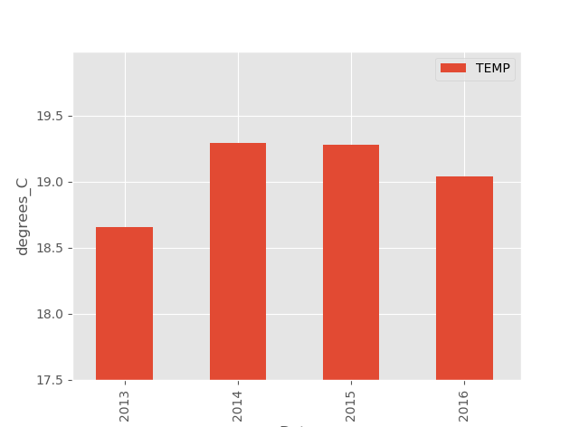

# Analyze a water temperature time series from netCDF files with MOODA

In this example, we will play with a sea water temperature time series of a mooring system near Tarragona (Spain.) We are going to use the MOODA app.

Data comes from a netCDF file of [EMODnet](http://www.emodnet.eu/). EMODnet is a network of organizations that make marine data with European format standards (such as SeaDataNet netCDF standards) freely available. For this example, we have to download the "reprocessed data" from 1992 to 2018 of the [Tarragona-coast-buoy](http://www.emodnet-physics.eu/map/platinfo/piroosdownload.aspx?platformid=28150). You need to register (it is free!) to download the file but you don't want to sign in EMODnet, you can download a monthly period.

Customarily, we open MOODA from a terminal just writing "mooda":

```bash
> mooda
```

Now we load the NetCDF file. Click on File->Open and look for the file downloaded from EMODnet (see Figure 1).


Figure 1: File -> Open

The file contains the parameter "seawater temperature" with the name "TEMP," but also it contains other parameters. Passing the cursor by the name of the parameters, a little more information will appear on the screen.


Figure 2: Main page

Since we only want to use the water temperature, we will eliminate other parameters to reduce the size of the object. Original data has already been processed by its source and data considered as good was marked with QC Flag = 1. We are only going to use the accurate data. We will also remove all NaN (Not a Number) values. Now the memory consumption of our object is much smaller.

```python
wf.use_only('TEMP', flags=1, dropnan=True)
print("Memory usage:", wf.memory_usage()/10**6, "MBytes")
```


Figure 3: Remove parameters


Figure 3: Remove data with QC Flag different to 0 and 1

Output:

```bash
Memory usage: 1.411648 MBytes
```


Figure 4: Seawater temperature time series

We need full year data to calculate the average annual temperature, so let's see what date the data starts and ends. The variable "data" of the WaterFrame object is a Pandas DataFrame so we can use all its functions and properties.

```python
print("Start:", wf.data.index[0])
print("End:", wf.data.index[-1])
```

Output:

```bash
Start: 2013-01-12 10:00:00
End: 2017-03-28 11:00:00
```

Now we know that we only have full years from 2013 to 2016. We are going to work with the complete years eliminating the data after 2016-12-31 23:59:59.

```python
wf.slice('20130101000000', '20161231235959')
```

Finally, we will create a bar graph with the annual average temperature.

```python
wf.barplot(key='TEMP', average_time='A')
plt.show()
```

Output:



Figure 1: Module types of oceanobs

The output of the WaterFrame.barplot function is a matplotlib.AxesSubplot so you could stylize the figure with the functions and properties of matplotlib.

From the graph, we can conclude that the average annual water temperature on the coast of Tarragona seems to tend to increase although we have very few data to be able to affirm it. The year with the lowest average temperature was 2013, with 18.6 ºC and the year with the highest average temperature was 2014, with 19.2 ºC.